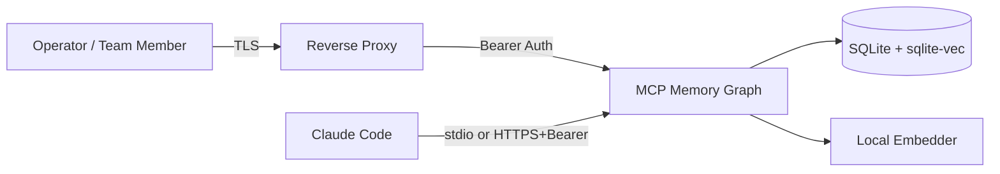

# Security Policy

## Supported versions

This project ships from `main`. Security fixes land on `main` and are tagged
with patch releases against the latest minor. Older minor branches are not
maintained.

| Version | Supported          |
|---------|--------------------|
| `1.x`   | :white_check_mark: |
| `< 1.0` | :x:                |

## Reporting a vulnerability

Please **do not** open a public GitHub issue for security problems.

Email **yonasmougaard@gmail.com** with:

- A description of the issue and its impact.
- Steps or a proof-of-concept that reproduces it.
- Any suggested mitigations.

You should expect an acknowledgment within 72 hours. Once a fix is ready
we coordinate disclosure timing with you and credit you in the changelog
unless you prefer to remain anonymous.

## Threat model

The memory server is designed to run in two modes:

1. **Local-only (default).** Bound to `127.0.0.1`. Only processes on the same
   machine can reach it. No bearer token required.
2. **Remote, behind an authenticated proxy.** Operators set
   `MCP_AUTH_TOKEN` and either bind to a non-loopback interface (`MCP_BIND`)
   or expose via a reverse proxy / Cloudflare Access tunnel.

Refusing to start when bound to a non-loopback interface without
`MCP_AUTH_TOKEN` is enforced in `buildApp` (`src/cli/serve.ts`). This is the
primary safety net against accidentally shipping an open-by-default server.

### What the server protects

- **Authentication.** Bearer token gates every `/api` and `/mcp` request.
  Constant-time comparison of `Authorization: Bearer <token>`.
- **CORS.** Allowlist via `MCP_ALLOWED_ORIGINS` (comma-separated). Origins
  not in the list receive no `Access-Control-Allow-Origin` response header.
  `Vary: Origin` is always set.
- **DNS rebinding (loopback only).** When bound to `127.0.0.1`, the server
  rejects requests whose `Host` header doesn't resolve to a localhost form.
- **Body size limits.** `express.json({ limit: MCP_BODY_LIMIT ?? '256kb' })`
  and `urlencoded({ limit: '64kb' })`. Larger payloads return 413.
- **Rate limiting.** Per-IP token bucket
  (`MCP_RATELIMIT_CAPACITY`, `MCP_RATELIMIT_REFILL_PER_SEC`). Excess
  requests get 429 with `Retry-After`.
- **Path traversal on hooks.** The Stop hook restricts the
  `transcript_path` payload to `~/.claude/projects` (override via
  `MCP_MEMORY_TRANSCRIPT_BASE`). See `src/hooks/memory-stop.ts`.
- **Schema integrity.** Partial / legacy databases throw a clear error on
  open instead of being silently re-stamped. Embedding-dimension changes
  are validated against the value persisted in `schema_meta.embedding_dim`.

### What the server does NOT protect

- **Multi-tenant isolation.** All memories share a single SQLite database;
  there is no per-user authorization. The bearer token is a single shared
  secret.
- **Encryption at rest.** SQLite files on disk are unencrypted. Operators
  who require encryption should run the server inside a filesystem with
  full-disk encryption (LUKS / FileVault / BitLocker).
- **Anti-brute-force on the bearer token.** Use a strong (≥ 32 byte
  base64-random) token. Rate limiting buys time but is not a substitute.
- **Input sanitization in stored content.** Memory content is treated as
  text and is not auto-rendered as HTML by the server. The web dashboard
  renders content inside `<pre>{...}</pre>` (React-escaped).

## Defaults you should change before exposing the server

```bash
# Generate a strong bearer token.
export MCP_AUTH_TOKEN="$(openssl rand -base64 32)"

# Restrict cross-origin access to your dashboard host(s).
export MCP_ALLOWED_ORIGINS="https://memory.example.com"

# Pick the surface you actually want exposed.
export MCP_BIND=127.0.0.1     # default — loopback only

# Tune the rate limiter for your real traffic.
export MCP_RATELIMIT_CAPACITY=60
export MCP_RATELIMIT_REFILL_PER_SEC=12

# Cap request bodies (importer is the largest consumer; raise as needed).
export MCP_BODY_LIMIT=512kb
```

## Trust Boundaries



The network-edge boundary sits at the reverse proxy, where TLS terminates. The auth boundary sits at the API, where the bearer token is checked in constant time. The data plane is local-only — SQLite and the embedder run inside the container alongside the server.
